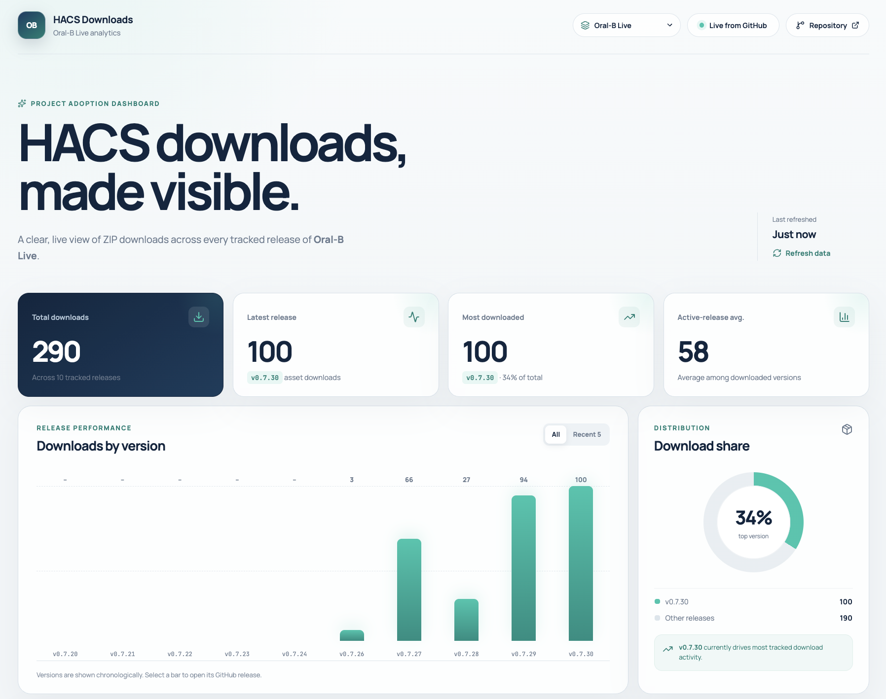

# HACS Download Analytics

[](https://github.com/thomasgregg/hacs-downloads/actions/workflows/deploy-pages.yml)
[](LICENSE)
[](https://react.dev/)

A fast, privacy-friendly dashboard for exploring GitHub release-asset downloads across HACS integrations and frontend cards.

HACS Download Analytics turns the download counters exposed by GitHub Releases into a clear, responsive overview of total downloads, release trends, distribution, and per-version performance. It runs entirely in the browser: no backend, database, analytics service, or GitHub token is required.

[View the live dashboard](https://thomasgregg.github.io/hacs-downloads/) · [Report an issue](https://github.com/thomasgregg/hacs-downloads/issues)



## Highlights

- Monitor multiple public GitHub repositories from one dashboard.
- Track integration `.zip` archives, frontend card `.js` bundles, or any consistently named release asset.
- Review total downloads, recent performance, download share, and individual releases.
- Switch projects without reloading and share the selected project through the URL.
- Cache successful responses locally to reduce GitHub API usage.
- Preserve cached data and retry automatically when GitHub rate limits are reached.
- Deploy as a fully static site with the included GitHub Pages workflow.

## How it works

GitHub records a `download_count` for every file uploaded to a release. For each configured project, the dashboard requests up to 100 published releases, selects the asset whose filename exactly matches `assetName`, and aggregates its download count.

```text
GitHub Releases API → matching release assets → browser-side aggregation → dashboard
```

A repository is compatible when it:

1. Is publicly accessible.
2. Publishes GitHub releases.
3. Uploads a dedicated asset to each release.
4. Uses a consistent, case-sensitive filename for that asset.

GitHub's automatically generated source archives are not release assets and do not expose the counter used by this dashboard. Draft releases and releases without the configured asset are ignored.

## Quick start

### Requirements

- Node.js 22.13 or newer
- npm

### Run locally

```bash
git clone https://github.com/thomasgregg/hacs-downloads.git
cd hacs-downloads
npm ci
npm run dev
```

Vite prints the local development URL in the terminal. To verify the production build:

```bash
npm run build
npm run preview
```

The optimized site is written to `dist/`.

## Configure projects

Projects are defined in the `PROJECTS` array near the top of [`src/App.tsx`](src/App.tsx). Each entry connects one GitHub repository to one release asset:

```ts
{
  id: 'example-integration',
  name: 'Example Integration',
  owner: 'github-owner',
  repo: 'example-integration',
  assetName: 'example_integration.zip',
  mark: 'EI',
  description: 'the Example Home Assistant integration',
},
```

Frontend cards use the same structure; only the asset filename changes:

```ts
{
  id: 'example-card',
  name: 'Example Card',
  owner: 'github-owner',
  repo: 'example-card',
  assetName: 'example-card.js',
  mark: 'EC',
  description: 'the Example Home Assistant dashboard card',
},
```

| Field | Description |
| --- | --- |
| `id` | Unique, URL-safe identifier used in links and browser cache keys. |
| `name` | Human-readable project name shown in the interface and page title. |
| `owner` | GitHub user or organization that owns the repository. |
| `repo` | Repository name without the owner or URL. |
| `assetName` | Exact, case-sensitive filename of the release asset to count. |
| `mark` | Short initials displayed in the project mark. |
| `description` | Project description used in page metadata. |

### Add, edit, or remove a project

To add a project, confirm that at least one published release contains the asset, add an entry with a unique `id`, and run the dashboard locally to verify its totals and links.

Edit an existing entry to update its presentation or repository details. Avoid changing its `id` unless necessary because existing shared URLs and local cache entries use it.

Remove a project by deleting its entry. If a URL references an unknown project, the dashboard safely falls back to the default project.

The first entry in `PROJECTS` is the default. The selector follows the array order.

## Shareable links

Selecting a project updates the query string without reloading the page:

```text
https://example.github.io/repository-name/?project=project-id
```

When the query parameter is missing or invalid, the dashboard restores the most recently selected project from browser storage, then falls back to the first configured project.

## Deployment

The included [GitHub Pages workflow](.github/workflows/deploy-pages.yml) builds and deploys the dashboard after every push to `main`. It also supports manual runs from the repository's **Actions** tab.

1. Open the repository on GitHub.
2. Go to **Settings → Pages**.
3. Set **Source** to **GitHub Actions**.
4. Push to `main` or run the workflow manually.

For a repository site, the `base` value in [`vite.config.ts`](vite.config.ts) must match the repository name:

```ts
export default defineConfig({
  base: '/repository-name/',
  plugins: [react()],
});
```

Use `/` for a user or organization site served from the domain root.

## Caching and API limits

The dashboard uses GitHub's unauthenticated public API. Each project's most recent successful response is stored in `localStorage` and reused for five minutes. If GitHub's rate limit is reached, cached data remains visible and the dashboard retries after the reset time reported by GitHub.

For a high-traffic deployment, use a server-side proxy with appropriate authentication and caching. Never place a GitHub access token in client-side code.

## Limitations

- Only public repositories are supported by the client-side implementation.
- Each project tracks one exact asset filename.
- The dashboard reads the first 100 releases returned by GitHub.
- Counts represent asset downloads, not unique users or HACS installations.
- Values are GitHub's current cumulative totals; the dashboard does not store historical snapshots.

## Technology

- [React](https://react.dev/) and [TypeScript](https://www.typescriptlang.org/)
- [Vite](https://vite.dev/)
- [GitHub REST API](https://docs.github.com/en/rest/releases/releases)
- GitHub Actions and GitHub Pages

## Contributing

Bug reports and focused pull requests are welcome. Before opening a pull request, run `npm run build` and confirm that the dashboard works at both desktop and mobile widths.

## License

HACS Download Analytics is available under the [MIT License](LICENSE). Copyright © 2026 Thomas Gregg.

This project is independent and is not affiliated with or endorsed by HACS, Home Assistant, or GitHub.
